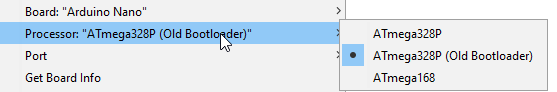

# ConradRelay_arduino
Code for Arduino (nano in my case) to work as Conrad Relay Card

Python example: 

```python
import serial

ser = serial.Serial('COM1', 9600)
ser.timeout = 4

def cmd(com, data):
    b = bytearray([com&0xFF, 0, data&0xFF, 0])
    b[3] = b[0] ^ b[1] ^ b[2]
    ser.write(b)
    print(ser.read(4))

print('init')
cmd(1, 0)
        
print('set all')
cmd(3, 0xFF)

print('reset all')
cmd(3, 0)

print('toggle pin D2')
cmd(8, 1)

```
### script/relay

```
Usage: relay [name, action]
ex: relay set all
ex: relay all off
ex: relay toggle kl15
Available relay names: ['kl30', 'kl15', 'eth', 'obd', 'all', 'eall', '1', '2', '3', '4', '5', '6']
Available actions: ['set', 'reset', 'toggle', 'on', 'off']
Serial port is taken from ENV_Var RELAY_PORT: COM8

```

To change pin names and ports, change it here: 
```
self.relays ={  'kl30': 0b0100, #d4
                'kl15': 0b0001, #d2
                'eth':  0b1000, #d5
                'obd':  0b0010, #d3
                'all':  0b11111111,
                'eall': 0b1111}
```

## Pin usage 

Count starts from GPIO D2 

## Relay

[Elegoo Relay Module DC 5V with Optocoupler for Arduino](https://www.amazon.de/gp/product/B01M8G4Y7Z/ref=ppx_yo_dt_b_search_asin_title?ie=UTF8&psc=1)

## Arduino

[Elegoo Compatible Nano Board for Arduino](https://www.amazon.de/gp/product/B0713ZRJLC/ref=ppx_yo_dt_b_search_asin_title?ie=UTF8&psc=1)


### Issues:

- Arduino reboots with each serial port reconnection, to fix remove a capactior, connected to RST pin (DTR-RST)


- flashing:
  
