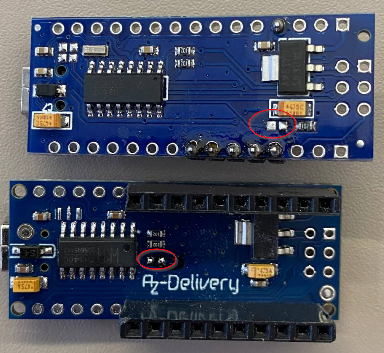

# ConradRelay_arduino
Code for Arduino (nano in my case) to work as Conrad Relay Card

Python example:

```python
import serial

ser = serial.Serial('COM1', 9600)
ser.timeout = 4

def cmd(com, data):
    b = bytearray([com&0xFF, 0, data&0xFF, 0])
    b[3] = b[0] ^ b[1] ^ b[2]
    ser.write(b)
    print(ser.read(4))

print('init')
cmd(1, 0)

print('set all')
cmd(3, 0xFF)

print('reset all')
cmd(3, 0)

print('toggle pin D2')
cmd(8, 1)

```
### script/relay

```
> relay --help

Usage: relay [name, action]
This script sends UART command to relay module
Examples:
 relay r1 on
 relay r2 toggle
 relay r3 toggle
 relay r4 off
 relay all off
Available relay names: r1, r2, r3, r4, all
Available actions: set, reset, toggle, on, off

Config file can be specified in environment variable RELAY_CONFIG
Current configuration used: '/home/maslovw/work/tools/ConradRelay_arduino/script/config.yaml'
Configured port /dev/ttyUSB0
Configured baudrate 9600

Note: arduino relay module Baudrate is 9600, but Conrad Relay module is 19200

```

To change pin names and ports, change it the config.yaml:
```
relay_port: "/dev/ttyUSB0"
relay_baudrate: 9600
relays:
  r1:  0b0001
  r2:  0b0010
  r3:  0b0100
  r4:  0b1000
  all: 0b1111
```

## Cargo build

Additionally there's rust application to control relay that one can use.

To build:

```
cd relayCtrl
cargo build
cargo install --path .
```
usage:

```
relay_control --help
relay_control 0.2.0
Control relays through a serial connection.

USAGE:
    relay_control [OPTIONS] <relay-name> <action>

FLAGS:
    -h, --help       Prints help information
    -V, --version    Prints version information

OPTIONS:
    -c, --config <config>    Custom path to the configuration file [default: config.toml]

ARGS:
    <relay-name>    Name of the relay to control.
    <action>        Action to perform on the relay.
                    Available actions: set, reset, toggle, on, off
```

## Pin usage

Count starts from GPIO D2

## Relay

[Elegoo Relay Module DC 5V with Optocoupler for Arduino](https://www.amazon.de/gp/product/B01M8G4Y7Z/ref=ppx_yo_dt_b_search_asin_title?ie=UTF8&psc=1)

## Arduino

[Elegoo Compatible Nano Board for Arduino](https://www.amazon.de/gp/product/B0713ZRJLC/ref=ppx_yo_dt_b_search_asin_title?ie=UTF8&psc=1)


### Issues:

- Arduino reboots with each serial port reconnection, to fix remove a capactior, connected to RST pin (DTR-RST)



- flashing:


